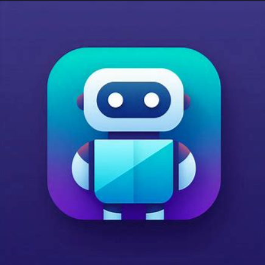
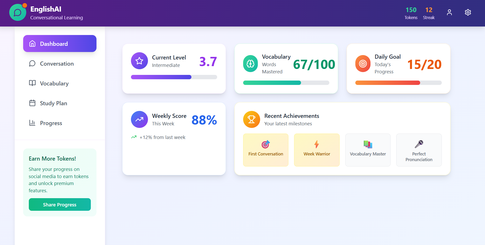
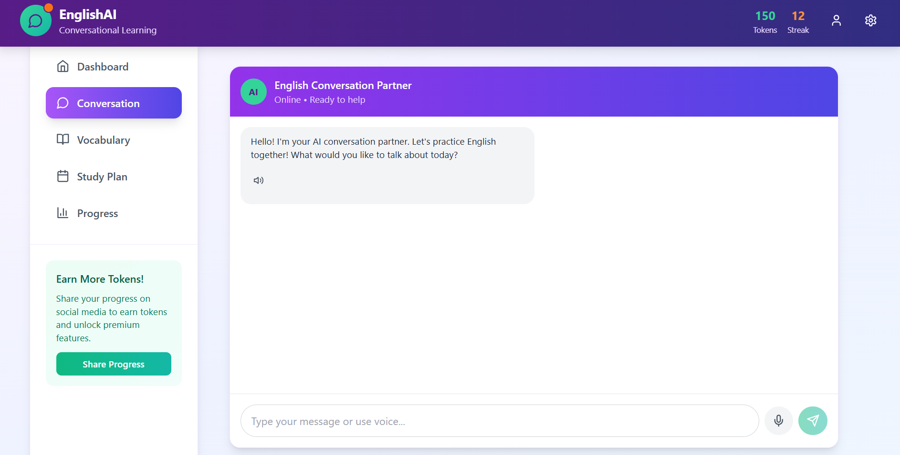
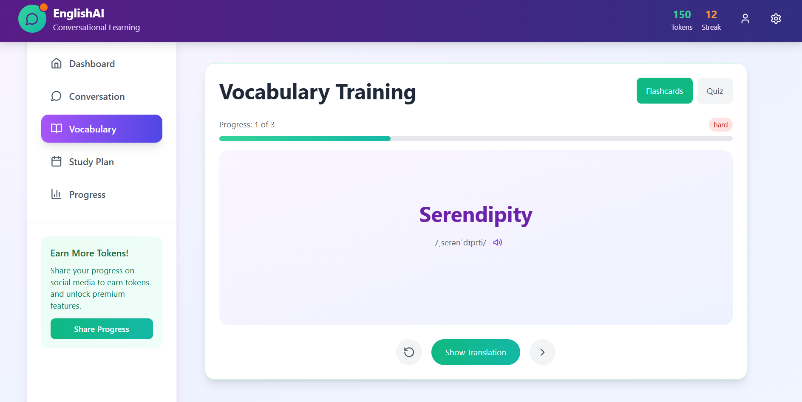
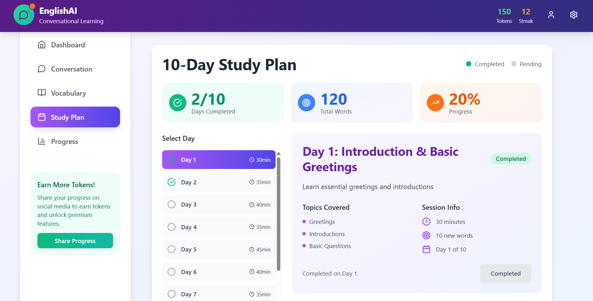
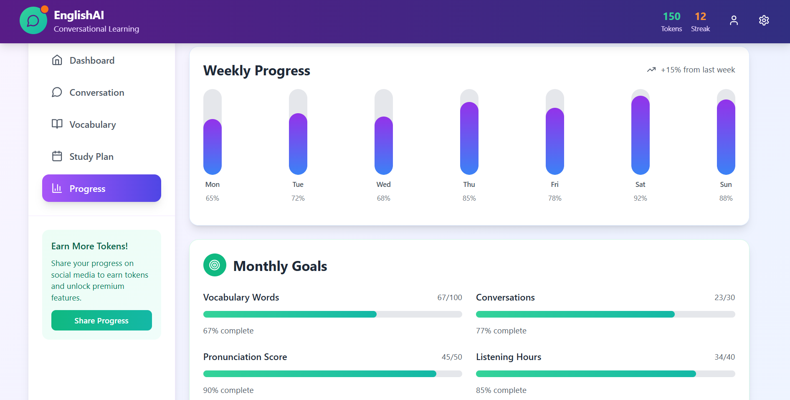

# EnglishAI - Aprendizaje Conversacional de Inglés 🌍

<div align="center">
  
</div>

## 🚀 Descripción del Proyecto

EnglishAI es una innovadora plataforma de aprendizaje de inglés diseñada específicamente para hispanohablantes. Combina la potencia de la inteligencia artificial con métodos científicamente probados de aprendizaje de idiomas, creando una experiencia única y efectiva para dominar el inglés conversacional.

## ✨ Características Principales

### 🤖 IA Conversacional
- Práctica de conversación en tiempo real con un AI partner
- Retroalimentación instantánea sobre pronunciación y gramática
- Adaptación al nivel y progreso del usuario

### 🎮 Gamificación Inteligente
- Sistema de asociación lógica de palabras
- Aprendizaje contextual vs. memorización tradicional
- Progreso visual y sistema de logros

### 📚 Sistema de Aprendizaje Científico
- Repetición espaciada optimizada
- 100 palabras en 10 días por temporada
- Seguimiento detallado del progreso

### 💎 Sistema de Tokens y Monetización

#### Modelo Freemium Innovador
El sistema de tokens de EnglishAI revoluciona el modelo freemium tradicional:

- **Utility Tokens**: Los usuarios ganan tokens por:
  - Compartir su progreso en redes sociales
  - Completar desafíos diarios
  - Mantener rachas de estudio
  - Alcanzar hitos de aprendizaje

- **Beneficios Premium**:
  - Acceso a lecciones avanzadas
  - Características exclusivas de práctica
  - Recursos adicionales de aprendizaje
  - Análisis detallado del progreso

#### Cómo Funciona
1. Los usuarios pueden ganar tokens compartiendo su progreso
2. Los tokens desbloquean contenido premium
3. Alternativa de suscripción premium para acceso completo

## 📱 Capturas de Pantalla

### Dashboard Principal
<div align="center">
  
</div>
Panel principal que muestra el progreso general, nivel actual y objetivos diarios.

### Práctica Conversacional
<div align="center">
  
</div>
Interfaz de chat con IA para práctica conversacional en tiempo real.

### Entrenamiento de Vocabulario
<div align="center">
  
</div>
Sistema de flashcards y ejercicios para aprendizaje de vocabulario.

### Plan de Estudio
<div align="center">
  
</div>
Programa estructurado de 10 días con objetivos específicos.

### Seguimiento de Progreso
<div align="center">
  
</div>
Estadísticas detalladas y seguimiento de objetivos mensuales.

## 🛠️ Tecnologías Utilizadas

- React + Vite
- TypeScript
- Tailwind CSS
- Node.js
- IA Conversacional
- APIs de Procesamiento de Lenguaje Natural

## 🚀 Instalación y Uso

1. Clonar el repositorio:
```bash
git clone https://github.com/riche45/project-EnglishAI.git
```

2. Instalar dependencias:
```bash
cd project-EnglishAI
npm install
```

3. Configurar variables de entorno:
```bash
cp .env.example .env
```

4. Iniciar el servidor de desarrollo:
```bash
npm run dev
```

## 📄 Licencia

Este proyecto está bajo la Licencia MIT - ver el archivo [LICENSE.md](LICENSE.md) para más detalles.

## 🤝 Contribuciones

Las contribuciones son bienvenidas. Por favor, lee [CONTRIBUTING.md](CONTRIBUTING.md) para detalles sobre nuestro código de conducta y el proceso para enviarnos pull requests. 